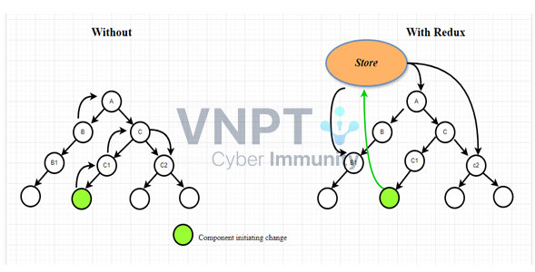

# Frontend

Các thư mục trong dự án.

- assets/ => Chứa hình ảnh, font chữ...
- components/ => Chứa các component tái sử dụng như Button, Blog, Friend, Notif...
- composables/ => Chứa các hàm dùng chung.
- router/ => Cấu hình định tuyến giữa các website (ví dụ trang chủ và trang cá nhân)
- services/ => Cấu hình API để giao tiếp với Backend
- store/ => Quản lý các state toàn cục với Pinia. Dùng để trao đổi data giữa các components
- views/ => Các trang ứng dụng (trang chủ, trang cá nhân...)

#### Dùng Store pinia để quản lý state

- Nếu như không dùng Store, thì khi chuyển data và functions giữa các components, ta cần chuyển data và functions lên component cha và truyền xuống lại các components con dưới dạng props và emits.
- Việc dùng Store tương tự như việc ta tạo 1 component làm cha chỉ chứa các data và functions chung, cần trao đổi qua lại giữa các components con.
  

# Backend

# API Integration

# Note
